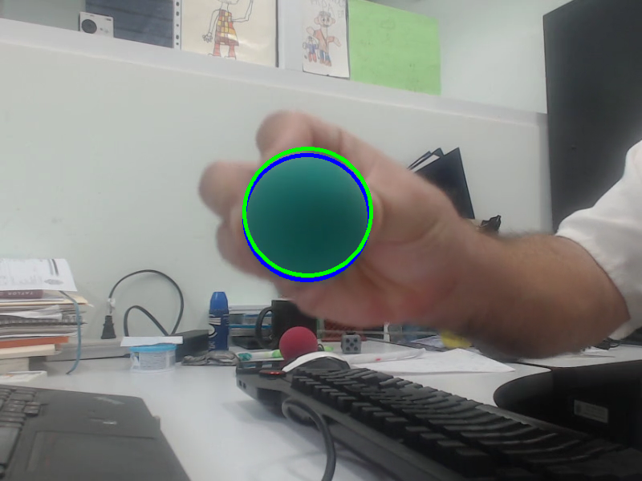
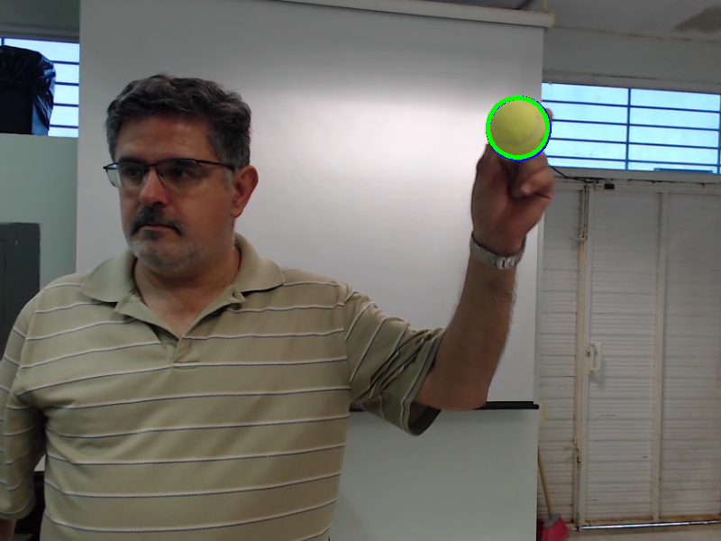
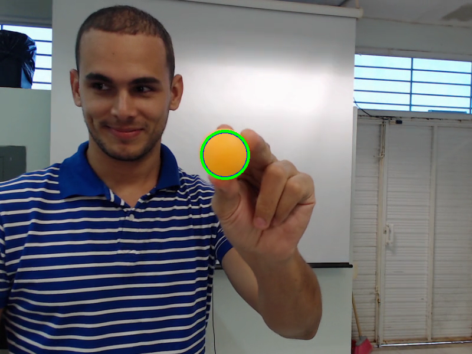
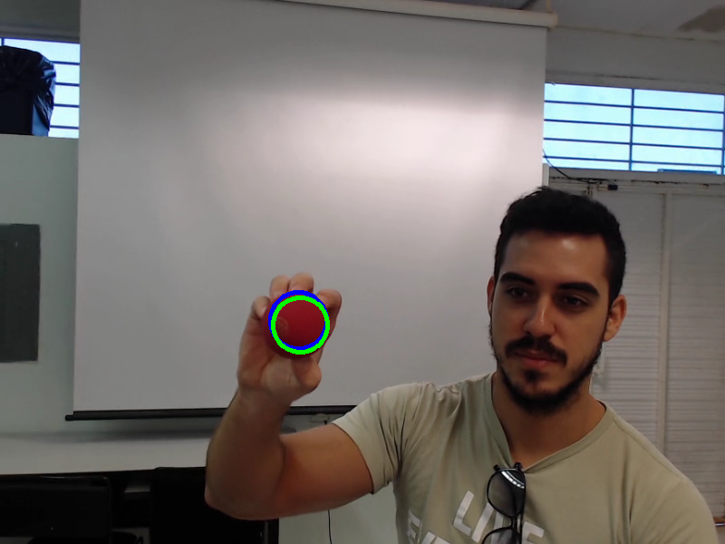

# Bayes Estimator


### <font color='orange'>Universidad Autónoma de Yucatán</font> _Facultad de Matemáticas_

**Teacher:** Dr. Arturo Espinosa Romero <[eromero@correo.uady.mx](mailto:eromero@correo.uady.mx)>

**Student:** Ing. Dayan Bravo Fraga <[dayan3847@gmail.com](mailto:dayan3847@gmail.com)>

# Ball Tracking *Kalman Filter*

## Legend



* Blue: **Measurement with `findContours` and *RANSAC*
* Green: Correction with *Kalman Filter*

## Environments

* **Tennis ball:** `ball_tennis` (default)
* **Orange ball:** `ball_orange`
* **Red ball:** `ball_red`
* **Green ball:** `ball_green` (in legend)



## Kalman Filter Types

* **Extended Kalman Filter:** `0` (default)
* **Implicit Extended Kalman Filter:** `1`

## Run

`./KalmanFilterBallTracking [ENVIRONMENT] [KALMAN_FILTER_TYPE];`

## Examples:

Tennis ball with Implicit Extended Kalman Filter:

```sh
./kalman_filter_ball_tracking ball_tennis 1;
```

Orange ball with Extended Kalman Filter:

```sh
./KalmanFilterBallTracking ball_orange 0;
```

## Installation

This project depends on the following library:

### Circle: (by Arturo Espinosa)

* https://github.com/arturoemx/Circle

### Clone

```sh
git clone https://github.com/arturoemx/Circle lib/arturoemx/Circle
```

### Note:

Last
commit: [1b3e61fd0203164265b804276546465898eaa3b7](https://github.com/arturoemx/Circle/commit/1b3e61fd0203164265b804276546465898eaa3b7)

## Install with CMake

### Requirements (Ubuntu 20.04)

#### [CMake](https://cmake.org/)

```sh
sudo apt install cmake -y
```

Check:

```sh
cmake --version
```

#### [Ninja Build](https://ninja-build.org/)

```sh
sudo apt install ninja-build -y
```

You can see: https://lindevs.com/install-ninja-build-system-on-ubuntu/

Check:

```sh
ninja --version
```

### Reload CMake Project

```sh
cmake -DCMAKE_BUILD_TYPE=Debug -DCMAKE_MAKE_PROGRAM=ninja -G Ninja -S ./ -B ./cmake-build-debug
```

### Build

```sh
cmake --build ./cmake-build-debug --target KalmanFilterBallTracking -j 6
cp ./cmake-build-debug/KalmanFilterBallTracking .
```

## Install with Make (by Arturo Espinosa)

```sh
make
```

You can see: [Makefile](Makefile)

## Analysis and Matrices

* [Extended Kalman Filter](doc/ball_tracking_kalman_filter_extended.ipynb)
* [Implicit Extended Kalman Filter](doc/ball_tracking_kalman_filter_extended_implicit.ipynb)

## Colaborators

* [Arturo Espinosa](https://github.com/arturoemx)
* [Dayan Bravo](https://github.com/dayan3847)
* [Mario Herrera](https://github.com/mario-infor)
