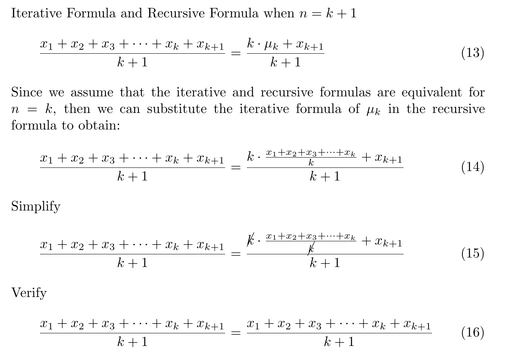

# Bayes Estimator

### Universidad Autónoma de Yucatán _Facultad de Matemáticas_

**Teacher:** Dr. Arturo Espinosa Romero <[eromero@correo.uady.mx](mailto:eromero@correo.uady.mx)>

**Student:** Ing. Dayan Bravo Fraga <[dayan3847@gmail.com](mailto:dayan3847@gmail.com)>

# Practice 1: Proof recursive _μ_ and _σ_.

Empirical demonstration of the equivalence of the standard and recursive functions of _μ_ and _σ_.

## GitHub: [Practice 1](https://github.com/dayan3847/bayes_estimator/tree/main/practice1) 

## Steps:

* Generate a random _μ_ and _σ_.
* Generate a quantity _N_ of random samples from a normal distribution with the parameters _μ_ and _σ_.
* Calculate the mean and variance of the samples generated in a non-recursive way.
* Calculate the mean and variance of the samples generated in a recursive way.
* Graph the mean and variance of the samples generated in a non-recursive and recursive way.
* Compare the results obtained.

## Results

# Practice 2: Analytical demonstration of _μ_ iterative and recursive.

Analytical demonstration of the equivalence of the iterative and recursive functions of _μ_.

## PDF Doc: [Practice 2](https://raw.githubusercontent.com/dayan3847/bayes_estimator/main/practice2/practice2.pdf)

## Preview:

## Conclusion:

It has been demonstrated using the method of mathematical induction.
We have shown that if the formulas are equivalent for _n = k_, then they are also equivalent for _n = k + 1_.
Since we have already shown that they are equivalent for _n = 1_ (base step),
we can conclude that the iterative and recursive formulas for calculating $\mu$ are equivalent for any value of $n$,
therefore, they are equally valid.

# Practice 3: Expected Value and Conditional Probability

## Instructions:

Present the following topics:

* Expected Value
* Conditional Probability

## PDF Presentation: [Practice 3](https://raw.githubusercontent.com/dayan3847/bayes_estimator/main/practice3/practice3.pdf)
