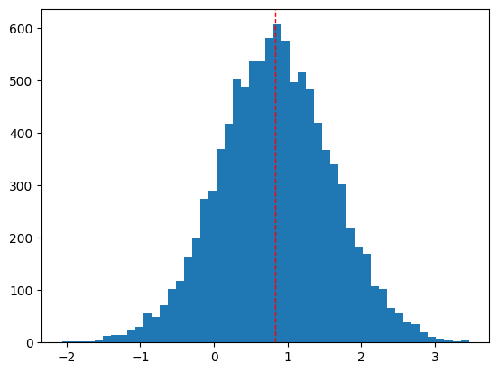
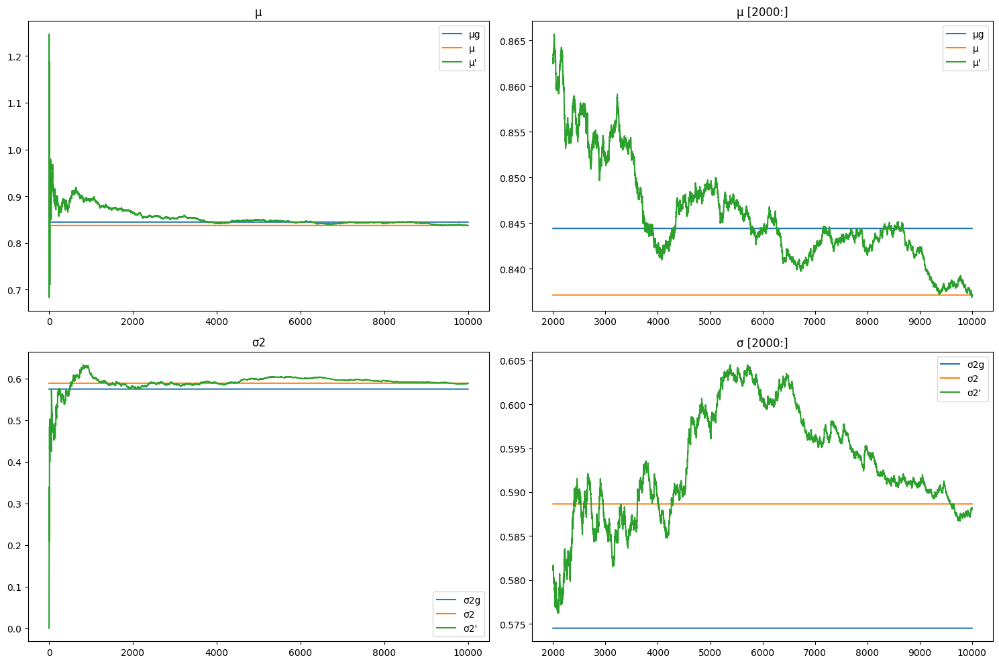

# Bayes Estimator

### Universidad Autónoma de Yucatán _Facultad de Matemáticas_

**Teacher:** Dr. Arturo Espinosa Romero <[eromero@correo.uady.mx](mailto:eromero@correo.uady.mx)>

**Student:** Ing. Dayan Bravo Fraga <[dayan3847@gmail.com](mailto:dayan3847@gmail.com)>

# Practice 1:  Proof recursive _μ_ and _σ_.

Empirical demonstration of the equivalence of the standard and recursive functions of _μ_ and _σ_.

## GitHub: [Practice 1](https://github.com/dayan3847/bayes_estimator/tree/main/practice1)

## Colab: 

## Steps:

* Generate a random _μ_ and _σ_.
* Generate a quantity _N_ of random samples from a normal distribution with the parameters _μ_ and _σ_.
* Calculate the mean and variance of the samples generated in a non-recursive way.
* Calculate the mean and variance of the samples generated in a recursive way.
* Graph the mean and variance of the samples generated in a non-recursive and recursive way.
* Compare the results obtained.

## Summary

### Histograms

### Results

